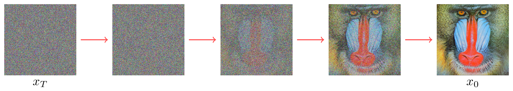
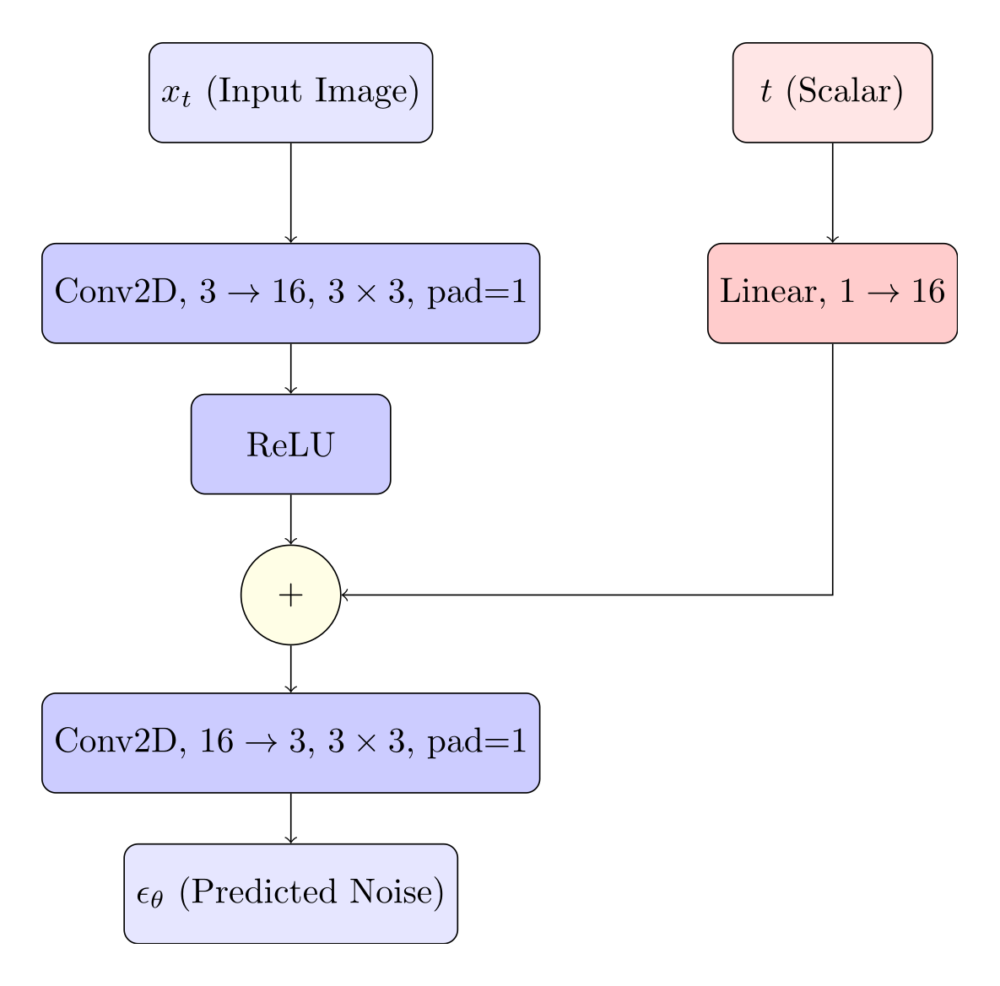
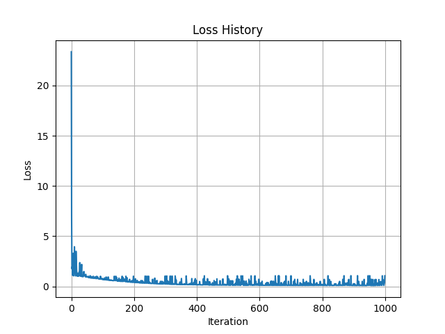

# Reverse Process / Training

## What is the reverse process?

In the forward process, at each timestep, we progressively added noise to the image. In the reverse, we'd like to denoise an image, starting with pure Gaussian noise, and removing some noise each timestep until we reach the final generated image.



Of course, because the noise added at step is random, there is no way to deterministically recover the actual image. Instead, we'll train a model to approximate the noise at timestep $t$, given image $x_t$.

Assuming we have some model that can predict this, our training objective now becomings minimizing the Kullback–Leibler divergence [[1]](#wikipedia2023kullbackleiblerdivergence) between our predictions and the ground truth. Or in simpler terms, we want to minimize the surprise from predictions from our model, compared to the actual distribution:

$$
\Huge
D_{KL}(p_{\theta}(x_{t-1}|x_t)\Vert q(x_t|x_{t-1}))
$$

If our model is a good predictor of the noise, then when we step backwards, our final generated image won't be the actual image, but it should be contained in a similar distribution to our training data.

## The Loss function

We won't step through all the math, but once simplified, the loss function becomes the mean squared error between the actual noise and the predicted noise.

$$
\Huge
\left\| \epsilon - \epsilon_{\theta} \right\|^2
$$

## Training

We now have the basic training loop:

1. Sample image $x_0$ from our dataset
2. Sample timetep $t$ from Uniform$`(1, \cdots, T)`$
3. Sample Gaussian noise $\epsilon$ from $\mathcal{N}(0, 1)$
4. Compute our noised image $x_t$ using $x_0$, $t$, $\epsilon$
5. Predict noise $\epsilon_{\theta}$ from our model, given $(x_t, t)$
6. Calculate loss using the mean squared error, $\left\| \epsilon - \epsilon_{\theta} \right\|^2$

Let's add this basic training loop to our code:

```python
model = Model().to(device)

optimizer = torch.optim.Adam(model.parameters(), lr=1e-3)
criterion = torch.nn.MSELoss()

loss_history = []
iterations = 1000

for it in range(iterations):
    optimizer.zero_grad()
    noise = torch.randn_like(x0, device=device)
    t = torch.randint(0, noise_scheduler.steps, (1,1), device=device)
    x_t = noise_scheduler.add_noise(x0, t, noise)
    pred_noise = model(x_t, t)
    loss = criterion(pred_noise, noise)
    loss_history.append(loss.item())
    if it % 100 == 0:
        print(f"Iteration {it}, Loss {loss.item()}")
    loss.backward()
    optimizer.step()
```

We now need a model, so let's create an extremely simple one: two convolutional layers for the image, and a linear layer that maps `t` to the same dimensions as our hidden layer, and adds it.



```python
class Model(torch.nn.Module):
    def __init__(self):
        super(Model, self).__init__()

        self.conv1 = torch.nn.Conv2d(3, 16, 3, padding=1)
        self.conv2 = torch.nn.Conv2d(16, 3, 3, padding=1)
        self.linear = torch.nn.Linear(1, 16)

    def forward(self, x, t):
        x = self.conv1(x)
        x = torch.nn.functional.relu(x)
        t = t.to(torch.float32)
        t = self.linear(t)
        x = x + t.view(-1, 16, 1, 1)
        x = self.conv2(x)
        return x
```

Finally, we'll make some changes to our `NoiseScheduler` class:
* Convert it to a `torch.nn.Module` so we can have it on the same device as the rest of our training code.
* Use a buffer for our computed schedule $\bar{\alpha}_t$ values (so they'll also be on the same device).
* Move the noise sampling step outside the scheduler. We want to sample it inside the training loop, so we can use it for the loss calculation

```python
class NoiseScheduler(torch.nn.Module):
    def __init__(self, steps=24, beta_start=1e-4, beta_end=0.6):
        super(NoiseScheduler, self).__init__()
        self.steps = steps
        self.beta_start = beta_start
        self.beta_end = beta_end

        beta = torch.linspace(beta_start, beta_end, steps)
        alpha = 1. - beta
        alpha_bar = torch.cumprod(alpha, 0)

        self.register_buffer('alpha_bar', alpha_bar)

    def add_noise(self, x0, t, noise):
        """
        Adds arbitrary noise to an image
        :param x0: initial image
        :param t: step number, 0 indexed (0 <= t < steps)
        :param noise: noise to add
        :return: image with noise at step t
        """
        alpha_bar = self.alpha_bar[t]
        return torch.sqrt(alpha_bar) * x0 + torch.sqrt(1 - alpha_bar) * noise
```

We can now train the model with:

```
python part_a_training.py
```

It trains for 1000 steps, printing out the loss every 100.
At the end of training, we plot the loss history:




Ok, great, we've successfully trained a model. But to be sure it works, we need to write the inference process! In the next chapter, we'll finally complete the implementation.

## References
1. <a id="wikipedia2023kullbackleiblerdivergence"></a>Wikipedia contributors. (2023). *Kullback-Leibler divergence*. In *Wikipedia, The Free Encyclopedia*. Retrieved from [https://en.wikipedia.org/wiki/Kullback-Leibler_divergence](https://en.wikipedia.org/wiki/Kullback-Leibler_divergence)
