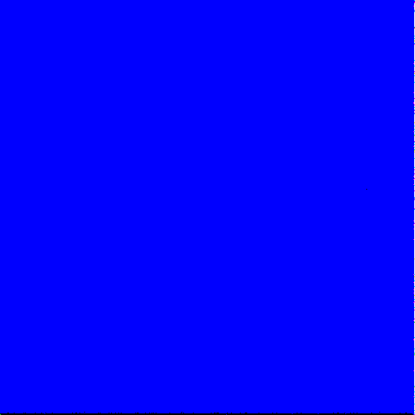
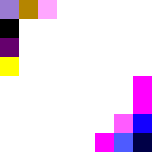
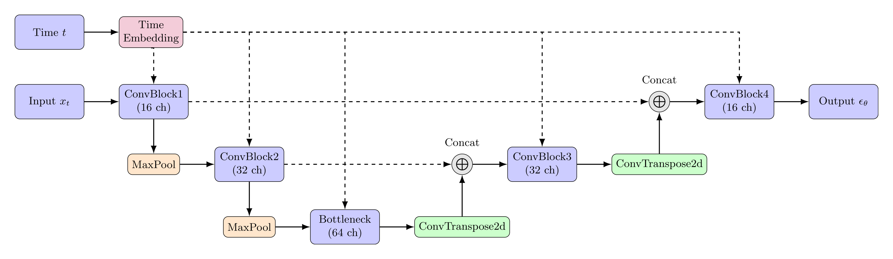
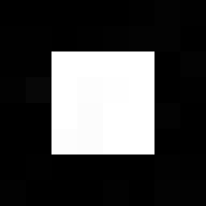

# Sampling / Inference

## How do we sample from a diffusion model?

#### Here is the basic procedure for sampling:

1. Sample $x_T$ from the normal distribution $\mathcal{N}(0, 1)$
2. For $t = T, \cdots, 1$:
   1. Sample $z$ from the normal distribution $\mathcal{N}(0, 1)$ if $t > 1$, else $z = 0$
   2. Compute the mean $\mu_t$ and variance $\sigma^2_t$, using $x_t$ and our schedule vars ($\bar{\alpha}_t$, $\beta_t$, etc.)
   3. Compute the previous stepL $x_{t-1} = \mu_t + \sigma_t * z$
4. Return $x_0$

---

#### The formulas for $\mu_t$ and $\sigma^2_t$ are:

```math
\Huge
\mu_{\theta}(x_t, t) = \frac{1}{\sqrt{\alpha_t}} \left( x_t - \frac{\beta_t}{\sqrt{1 - \bar{\alpha}_t}} \epsilon_{\theta}(x_t, t) \right)
```

$$
\Huge
\sigma^2_{\theta}(x_t, t) = \frac{1 - \bar{\alpha}_t}{\sqrt{1 - \bar{\alpha}_t}} \beta_t
$$

---

## (A) Implementing the sampling process

Let's add a `sample_prev_step` function to our sampler module:

```python
 def sample_prev_step(self, xt, t, pred_noise):
   z = torch.randn_like(xt)
   z[t.expand_as(z) == 0] = 0

   mean = (1 / torch.sqrt(self.alpha[t])) * (xt - (self.beta[t] / torch.sqrt(1 - self.alpha_bar[t])) * pred_noise)
   var = ((1 - self.alpha_bar[t - 1])  / (1 - self.alpha_bar[t])) * self.beta[t]
   sigma = torch.sqrt(var)

   x = mean + sigma * z
   return x
```

Our sampling loop is relatively simple:

```python
 x = torch.randn(1, 3, 512, 512).to(device)
 for step in range(num_steps-1, -1, -1):
     t = torch.tensor(step, device=device).view(1,)
     pred_noise = model(x, t)
     x = noise_scheduler.sample_prev_step(x, t, pred_noise)
```

You can run this with:

```bash
python part_a_sampling.py
```

Of course, without a trained model, the output is not very good:



## (B) Overfitting a single image

Let's combine this with our training code and see if we can overfit a single image

We'll use a really small target image:

```python
 x0 = torch.zeros(1, 3, 8, 8).to(device)
 x0[:, :, 2:6, 2:6] = 1
```


*Note: (8x8), resized for display*

We train for 10,000 iterations, and sample at the end:

```bash
python part_b_overfitting.py
```

Unfortunately, the output is still pretty noisy:



## (C) Overfitting part 2.

Let's try to improve this:
* Our schedule is only 24 steps long. Let's increase it to 1000, and adjust our beta end to 0.02, to match the paper.
* We currently use a batch size of 1. Let's increase this to 128.
* Let's reduce our learning rate to `1e-4`
* We're currently training in color, let's switch to grayscale.
* Finally, let's increase our model complexity.

Our new model uses a simple U-Net architecture, with an embedding layer that is used to condition the model:

```python
class ConvBlock(torch.nn.Module):
   def __init__(self, in_channels, out_channels, embed_dim):
      super(ConvBlock, self).__init__()
      self.conv1 = torch.nn.Conv2d(in_channels, out_channels, 3, padding=1)
      self.proj = torch.nn.Linear(embed_dim, out_channels)
      self.conv2 = torch.nn.Conv2d(out_channels, out_channels, 3, padding=1)

   def forward(self, x, embedding):
      x = self.conv1(x)
      emb_proj = self.proj(embedding).view(-1, x.size(1), 1, 1)
      x = torch.nn.functional.relu(x + emb_proj)
      x = self.conv2(x)
      x = torch.nn.functional.relu(x)
      return x

class Model(torch.nn.Module):
   def __init__(self, num_steps=1000, embed_dim=16):
      super(Model, self).__init__()

      self.embed = torch.nn.Embedding(num_steps, embed_dim)

      self.enc1 = ConvBlock(1, 16, embed_dim)
      self.enc2 = ConvBlock(16, 32, embed_dim)
      self.bottleneck = ConvBlock(32, 64, embed_dim)
      self.upconv2 = torch.nn.ConvTranspose2d(64, 32, kernel_size=2, stride=2)
      self.dec2 = ConvBlock(64, 32, embed_dim)
      self.upconv1 = torch.nn.ConvTranspose2d(32, 16, kernel_size=2, stride=2)
      self.dec1 = ConvBlock(32, 16, embed_dim)
      self.final = torch.nn.Conv2d(16, 1, kernel_size=1)

   def forward(self, x, t):
      emb = self.embed(t)

      enc1 = self.enc1(x, emb)
      enc2 = self.enc2(torch.nn.functional.max_pool2d(enc1, 2), emb)
      bottleneck = self.bottleneck(torch.nn.functional.max_pool2d(enc2, 2), emb)
      dec2 = self.dec2(torch.cat([enc2, self.upconv2(bottleneck)], 1), emb)
      dec1 = self.dec1(torch.cat([enc1, self.upconv1(dec2)], 1), emb)
      out = self.final(dec1)
      return out
```



You can run this with:

```bash
python part_c_overfitting_2.py
```



This looks better. In the next chapter, let's explore some more serious model architectures, and see if we train a model that can generate realistic non-trivial images.

