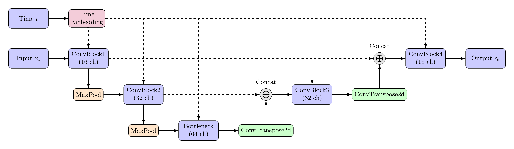

# MNIST

## Training a diffusion model on the MNIST dataset


The MNIST dataset is a dataset of handwritten digits, each of which is a 28x28 grayscale image. 
We'll train a diffusion model to generate new images of handwritten digits.

## (A) Initial model

We'll start by using the same model architecture as in the previous chapter, and train for 10 epochs.

```python
class ConvBlock(torch.nn.Module):
   def __init__(self, in_channels, out_channels, embed_dim):
      super(ConvBlock, self).__init__()
      self.conv1 = torch.nn.Conv2d(in_channels, out_channels, 3, padding=1)
      self.proj = torch.nn.Linear(embed_dim, out_channels)
      self.conv2 = torch.nn.Conv2d(out_channels, out_channels, 3, padding=1)

   def forward(self, x, embedding):
      x = self.conv1(x)
      emb_proj = self.proj(embedding).view(-1, x.size(1), 1, 1)
      x = torch.nn.functional.relu(x + emb_proj)
      x = self.conv2(x)
      x = torch.nn.functional.relu(x)
      return x

class Model(torch.nn.Module):
   def __init__(self, num_steps=1000, embed_dim=16):
      super(Model, self).__init__()

      self.embed = torch.nn.Embedding(num_steps, embed_dim)

      self.enc1 = ConvBlock(1, 16, embed_dim)
      self.enc2 = ConvBlock(16, 32, embed_dim)
      self.bottleneck = ConvBlock(32, 64, embed_dim)
      self.upconv2 = torch.nn.ConvTranspose2d(64, 32, kernel_size=2, stride=2)
      self.dec2 = ConvBlock(64, 32, embed_dim)
      self.upconv1 = torch.nn.ConvTranspose2d(32, 16, kernel_size=2, stride=2)
      self.dec1 = ConvBlock(32, 16, embed_dim)
      self.final = torch.nn.Conv2d(16, 1, kernel_size=1)

   def forward(self, x, t):
      emb = self.embed(t)

      enc1 = self.enc1(x, emb)
      enc2 = self.enc2(torch.nn.functional.max_pool2d(enc1, 2), emb)
      bottleneck = self.bottleneck(torch.nn.functional.max_pool2d(enc2, 2), emb)
      dec2 = self.dec2(torch.cat([enc2, self.upconv2(bottleneck)], 1), emb)
      dec1 = self.dec1(torch.cat([enc1, self.upconv1(dec2)], 1), emb)
      out = self.final(dec1)
      return out
```



We can run this with:

```bash
python part_a_mnist.py train
```

You can also change additional hyperparameters, such as the learning rate, batch size, and number of epochs:

```bash
python part_a_mnist.py train --batch-size 128 --lr 1e-3 --epochs 10
```

After training, we can sample a grid of images from the model with:
    
```bash
python part_a_mnist.py test
```

Our resulting output looks like this:


As you can see, we have some room for improvement.

## (B) Evaluation

## (C) Improving the model

Let's make some changes to our model:

### Positional Encoding

In our previous models, we used an embedding layer to learn a unique embedding for each timestep. 
However, another common technique is to use a positional encoding, which is a fixed function of the timestep.
This is the same technique used with transformers to encode the position of each token in the sequence.

We can define a simple positional encoding function as follows:

```python
class PositionalEncoding(torch.nn.Module):
    def __init__(self, d_model, max_len=5000):
        super(PositionalEncoding, self).__init__()

        # Create a matrix to hold the positional encodings
        pe = torch.zeros(max_len, d_model)

        # Compute the positional encodings
        position = torch.arange(0, max_len, dtype=torch.float).unsqueeze(1)
        div_term = torch.exp(torch.arange(0, d_model, 2).float() * (-math.log(10000.0) / d_model))

        pe[:, 0::2] = torch.sin(position * div_term)
        pe[:, 1::2] = torch.cos(position * div_term)

        # Register pe as a buffer to avoid updating it during backpropagation
        self.register_buffer('pe', pe)

    def forward(self, x):
        # Retrieve the positional encodings
        return self.pe[x]
```

We can think of positional encoding as a fixed function that maps each timestep to a unique vector.
If you're familiar with Fourier series, you might recognize that each component of the positional encoding is a sine or cosine function with a different frequency.

Let's train our new model:

```bash
python part_c_mnist.py train
```

You can also change additional hyperparameters, such as the learning rate, batch size, and number of epochs:

```bash
python part_c_mnist.py train --batch-size 128 --lr 1e-3 --epochs 10
```

After training, we can sample a grid of images from the model with:
    
```bash
python part_c_mnist.py test
```

Our resulting output looks like this:


We can see that our model has improved significantly, and we've even reduced the number of parameters by switching to positional encoding.

## (D) More Improvements

We'll continue with two more changes to our model:

### Normalization

We'll modify our `ConvBlock` modules to include `GroupNorm` layers for normalization:

```python
class ConvBlock(torch.nn.Module):
    def __init__(self, in_channels, out_channels, embed_dim):
        super(ConvBlock, self).__init__()
        self.norm1 = torch.nn.GroupNorm(16, in_channels)
        self.conv1 = torch.nn.Conv2d(in_channels, out_channels, kernel_size=3, padding=1)
        self.proj = torch.nn.Linear(embed_dim, out_channels)
        self.norm2 = torch.nn.GroupNorm(16, out_channels)
        self.conv2 = torch.nn.Conv2d(out_channels, out_channels, kernel_size=3, padding=1)

    def forward(self, x, embedding):
        x = self.norm1(x)
        x = torch.nn.functional.relu(x)
        x = self.conv1(x)
        emb_proj = self.proj(embedding).view(-1, x.size(1), 1, 1)
        x = x + emb_proj
        x = self.norm2(x)
        x = torch.nn.functional.relu(x)
        x = self.conv2(x)
        return x
```

### More Advanced Embedding

We'll also update our embedding to follow our positional encoding with two fully-connected layers:

```python
self.embed = torch.nn.Sequential(
    PositionalEncoding(embed_dim, num_steps),
    torch.nn.Linear(embed_dim, embed_dim),
    torch.nn.ReLU(),
    torch.nn.Linear(embed_dim, embed_dim),
    torch.nn.ReLU(),
)
```

### Model

Our new model looks like this:

```python
class Model(torch.nn.Module):
    def __init__(self, num_steps=1000, embed_dim=64):
        super(Model, self).__init__()

        self.embed = torch.nn.Sequential(
            PositionalEncoding(embed_dim, num_steps),
            torch.nn.Linear(embed_dim, embed_dim),
            torch.nn.ReLU(),
            torch.nn.Linear(embed_dim, embed_dim),
            torch.nn.ReLU(),
        )

        self.conv_in = torch.nn.Conv2d(1, 16, kernel_size=3, padding=1)
        self.enc1 = ConvBlock(16, 16, embed_dim)
        self.enc2 = ConvBlock(16, 32, embed_dim)
        self.bottleneck = ConvBlock(32, 64, embed_dim)
        self.upconv2 = torch.nn.ConvTranspose2d(64, 32, kernel_size=2, stride=2)
        self.dec2 = ConvBlock(64, 32, embed_dim)
        self.upconv1 = torch.nn.ConvTranspose2d(32, 16, kernel_size=2, stride=2)
        self.dec1 = ConvBlock(32, 16, embed_dim)
        self.norm_out = torch.nn.GroupNorm(16, 16)
        self.conv_out = torch.nn.Conv2d(16, 1, kernel_size=3, padding=1)

    def forward(self, x, t):
        emb = self.embed(t)

        x = self.conv_in(x)
        enc1 = self.enc1(x, emb)
        enc2 = self.enc2(torch.nn.functional.max_pool2d(enc1, 2), emb)
        bottleneck = self.bottleneck(torch.nn.functional.max_pool2d(enc2, 2), emb)
        dec2 = self.dec2(torch.cat([enc2, self.upconv2(bottleneck)], 1), emb)
        dec1 = self.dec1(torch.cat([enc1, self.upconv1(dec2)], 1), emb)
        out = self.norm_out(dec1)
        out = torch.nn.functional.relu(out)
        out = self.conv_out(out)
        return out
```

Let's train this model now:

```bash
python part_d_mnist.py train
```

You can also change additional hyperparameters, such as the learning rate, batch size, and number of epochs:

```bash
python part_d_mnist.py train --batch-size 128 --lr 1e-3 --epochs 20
```

After training, we can sample a grid of images from the model with:
    
```bash
python part_d_mnist.py test
```

Our resulting output looks like this:


This is already looking quite good, but we can still make further improvements.

## (E) Final Improvements

We can further improve our model with the following improvements:

### Residual Connections

We'll replace our `ConvBlock` modules with a more advanced residual block:

```python
class ResnetBlock(torch.nn.Module):
    def __init__(self, in_channels, out_channels, embed_dim):
        super(ResnetBlock, self).__init__()
        self.norm1 = torch.nn.GroupNorm(16, in_channels)
        self.conv1 = torch.nn.Conv2d(in_channels, out_channels, kernel_size=3, padding=1)
        self.proj = torch.nn.Linear(embed_dim, out_channels)
        self.norm2 = torch.nn.GroupNorm(16, out_channels)
        self.conv2 = torch.nn.Conv2d(out_channels, out_channels, kernel_size=3, padding=1)
        self.shortcut = torch.nn.Conv2d(in_channels, out_channels, kernel_size=1) if in_channels != out_channels else None

    def forward(self, x, embedding):
        _input = x
        x = self.norm1(x)
        x = torch.nn.functional.relu(x)
        x = self.conv1(x)
        emb_proj = self.proj(embedding).view(-1, x.size(1), 1, 1)
        x = x + emb_proj
        x = self.norm2(x)
        x = torch.nn.functional.relu(x)
        x = self.conv2(x)
        if self.shortcut is not None:
            _input = self.shortcut(_input)
        return x + _input
```

This allows us to stack multiple residual blocks together, and still maintain a good flow of gradients.

### Improved Downsampling and Upsampling

Currently, we use max pooling for downsampling and transposed convolutions for upsampling.

Let's replace our max pooling layers with strided convolutions:

```python
class Downsample(torch.nn.Module):
    def __init__(self, in_channels, out_channels):
        super(Downsample, self).__init__()
        self.conv = torch.nn.Conv2d(in_channels, out_channels, kernel_size=3, stride=2, padding=1)

    def forward(self, x):
        return self.conv(x)
```

Instead of transposed convolutions, we'll use nearest-neighbor upsampling followed by a convolution:

```python
class Upsample(torch.nn.Module):
    def __init__(self, in_channels, out_channels):
        super(Upsample, self).__init__()
        self.conv = torch.nn.Conv2d(in_channels, out_channels, kernel_size=3, padding=1)

    def forward(self, x):
        x = torch.nn.functional.interpolate(x, scale_factor=2, mode='nearest')
        x = self.conv(x)
        return x
```

Our new model looks like this:

```python
class Model(torch.nn.Module):
    def __init__(self, num_steps=1000, embed_dim=64):
        super(Model, self).__init__()

        self.embed = torch.nn.Sequential(
            PositionalEncoding(embed_dim, num_steps),
            torch.nn.Linear(embed_dim, embed_dim),
            torch.nn.ReLU(),
            torch.nn.Linear(embed_dim, embed_dim),
            torch.nn.ReLU(),
        )

        self.conv_in = torch.nn.Conv2d(1, 16, kernel_size=3, padding=1)
        self.enc1_1 = ResnetBlock(16, 16, embed_dim)
        self.enc1_2 = ResnetBlock(16, 32, embed_dim)
        self.downconv1 = Downsample(32, 32)
        self.enc2_1 = ResnetBlock(32, 32, embed_dim)
        self.enc2_2 = ResnetBlock(32, 64, embed_dim)
        self.downconv2 = Downsample(64, 64)
        self.bottleneck_1 = ResnetBlock(64, 64, embed_dim)
        self.bottleneck_2 = ResnetBlock(64, 64, embed_dim)
        self.upconv2 = Upsample(64, 64)
        self.dec2_1 = ResnetBlock(128, 64, embed_dim)
        self.dec2_2 = ResnetBlock(64, 32, embed_dim)
        self.upconv1 = Upsample(32, 32)
        self.dec1_1 = ResnetBlock(64, 32, embed_dim)
        self.dec1_2 = ResnetBlock(32, 16, embed_dim)
        self.norm_out = torch.nn.GroupNorm(16, 16)
        self.conv_out = torch.nn.Conv2d(16, 1, kernel_size=3, padding=1)

    def forward(self, x, t):
        emb = self.embed(t)

        x = self.conv_in(x)
        x = self.enc1_1(x, emb)
        enc1 = self.enc1_2(x, emb)
        x = self.downconv1(enc1)
        x = self.enc2_1(x, emb)
        enc2 = self.enc2_2(x, emb)
        x = self.downconv2(enc2)
        x = self.bottleneck_1(x, emb)
        x = self.bottleneck_2(x, emb)
        x = self.upconv2(x)
        x = torch.cat([x, enc2], 1)
        x = self.dec2_1(x, emb)
        x = self.dec2_2(x, emb)
        x = self.upconv1(x)
        x = torch.cat([x, enc1], 1)
        x = self.dec1_1(x, emb)
        x = self.dec1_2(x, emb)
        x = self.norm_out(x)
        x = torch.nn.functional.relu(x)
        x = self.conv_out(x)
        return x
```

Let's train this model now:

```bash
python main.py train
```

We can also change additional hyperparameters, such as the learning rate, batch size, and number of epochs:

```bash
python main.py train --batch-size 128 --lr 1e-3 --epochs 80
```

After training, we can sample a grid of images from the model with:
    
```bash
python main.py test
```

Our resulting output looks like this:


This output is significantly better than our previous models!