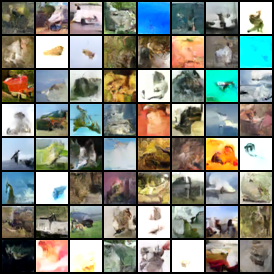
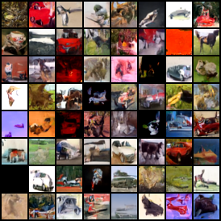

# CIFAR-10

## Training a diffusion model on the CIFAR-10 dataset


The CIFAR-10 dataset is a dataset of 32x32 color images, from 10 classes (airplane, automobile, bird, cat, deer, dog, frog, horse, ship, truck).
We'll train a diffusion model on this dataset, and generate samples from the model.

## (A) Initial model

We'll start by using the same model architecture as in the previous chapter, and train for 80 epochs.

```python
class Model(torch.nn.Module):
    def __init__(self, num_steps=1000, embed_dim=64):
        super(Model, self).__init__()

        self.embed = torch.nn.Sequential(
            PositionalEncoding(embed_dim, num_steps),
            torch.nn.Linear(embed_dim, embed_dim),
            torch.nn.ReLU(),
            torch.nn.Linear(embed_dim, embed_dim),
            torch.nn.ReLU(),
        )

        self.conv_in = torch.nn.Conv2d(3, 16, kernel_size=3, padding=1)
        self.enc1_1 = ResnetBlock(16, 16, embed_dim)
        self.enc1_2 = ResnetBlock(16, 32, embed_dim)
        self.downconv1 = Downsample(32, 32)
        self.enc2_1 = ResnetBlock(32, 32, embed_dim)
        self.enc2_2 = ResnetBlock(32, 64, embed_dim)
        self.downconv2 = Downsample(64, 64)
        self.bottleneck_1 = ResnetBlock(64, 64, embed_dim)
        self.bottleneck_2 = ResnetBlock(64, 64, embed_dim)
        self.upconv2 = Upsample(64, 64)
        self.dec2_1 = ResnetBlock(128, 64, embed_dim)
        self.dec2_2 = ResnetBlock(64, 32, embed_dim)
        self.upconv1 = Upsample(32, 32)
        self.dec1_1 = ResnetBlock(64, 32, embed_dim)
        self.dec1_2 = ResnetBlock(32, 16, embed_dim)
        self.norm_out = torch.nn.GroupNorm(16, 16)
        self.conv_out = torch.nn.Conv2d(16, 3, kernel_size=3, padding=1)

    def forward(self, x, t):
        emb = self.embed(t)

        x = self.conv_in(x)
        x = self.enc1_1(x, emb)
        enc1 = self.enc1_2(x, emb)
        x = self.downconv1(enc1)
        x = self.enc2_1(x, emb)
        enc2 = self.enc2_2(x, emb)
        x = self.downconv2(enc2)
        x = self.bottleneck_1(x, emb)
        x = self.bottleneck_2(x, emb)
        x = self.upconv2(x)
        x = torch.cat([x, enc2], 1)
        x = self.dec2_1(x, emb)
        x = self.dec2_2(x, emb)
        x = self.upconv1(x)
        x = torch.cat([x, enc1], 1)
        x = self.dec1_1(x, emb)
        x = self.dec1_2(x, emb)
        x = self.norm_out(x)
        x = torch.nn.functional.relu(x)
        x = self.conv_out(x)
        return x
```

We can run this with:

```bash
python part_a_cifar.py train
```

You can also change additional hyperparameters, such as the learning rate, batch size, and number of epochs:

```bash
python part_a_cifar.py train --batch-size 128 --lr 1e-3 --epochs 80
```

After training, we can sample a grid of images from the model with:

```bash
python part_a_cifar.py test
```

Our resulting output looks like this:



## (B) More channels

By increasing the number of channels in our model, we can improve the quality of the generated images. Let's double the number of channels in our models from 16 to 32.

```python
class Model(torch.nn.Module):
    def __init__(self, num_steps=1000, ch=32):
        super(Model, self).__init__()

        embed_dim = ch*4
        self.embed = torch.nn.Sequential(
            PositionalEncoding(ch, num_steps),
            torch.nn.Linear(ch, embed_dim),
            torch.nn.ReLU(),
            torch.nn.Linear(embed_dim, embed_dim),
            torch.nn.ReLU(),
        )

        self.conv_in = torch.nn.Conv2d(3, ch, kernel_size=3, padding=1)
        self.enc1_1 = ResnetBlock(ch, ch, embed_dim)
        self.enc1_2 = ResnetBlock(ch, ch*2, embed_dim)
        self.downconv1 = Downsample(ch*2, ch*2)
        self.enc2_1 = ResnetBlock(ch*2, ch*2, embed_dim)
        self.enc2_2 = ResnetBlock(ch*2, ch*4, embed_dim)
        self.downconv2 = Downsample(ch*4, ch*4)
        self.bottleneck_1 = ResnetBlock(ch*4, ch*4, embed_dim)
        self.bottleneck_2 = ResnetBlock(ch*4, ch*4, embed_dim)
        self.upconv2 = Upsample(ch*4, ch*4)
        self.dec2_1 = ResnetBlock(ch*8, ch*4, embed_dim)
        self.dec2_2 = ResnetBlock(ch*4, ch*2, embed_dim)
        self.upconv1 = Upsample(ch*2, ch*2)
        self.dec1_1 = ResnetBlock(ch*4, ch*2, embed_dim)
        self.dec1_2 = ResnetBlock(ch*2, ch, embed_dim)
        self.norm_out = torch.nn.GroupNorm(32, ch)
        self.conv_out = torch.nn.Conv2d(ch, 3, kernel_size=3, padding=1)

    def forward(self, x, t):
        emb = self.embed(t)

        x = self.conv_in(x)
        x = self.enc1_1(x, emb)
        enc1 = self.enc1_2(x, emb)
        x = self.downconv1(enc1)
        x = self.enc2_1(x, emb)
        enc2 = self.enc2_2(x, emb)
        x = self.downconv2(enc2)
        x = self.bottleneck_1(x, emb)
        x = self.bottleneck_2(x, emb)
        x = self.upconv2(x)
        x = torch.cat([x, enc2], 1)
        x = self.dec2_1(x, emb)
        x = self.dec2_2(x, emb)
        x = self.upconv1(x)
        x = torch.cat([x, enc1], 1)
        x = self.dec1_1(x, emb)
        x = self.dec1_2(x, emb)
        x = self.norm_out(x)
        x = torch.nn.functional.silu(x)
        x = self.conv_out(x)
        return x
```

Let's train this model now:

```bash
python part_b_cifar_more_channels.py train
```

You can also change additional hyperparameters, such as the learning rate, batch size, number of epochs, and number of channels:

```bash
python part_b_cifar_more_channels.py train --batch-size 128 --lr 1e-3 --epochs 120 --model-channels 32
```

After training, we can sample a grid of images from the model with:

```bash
python part_b_cifar_more_channels.py test --model-channels 32
```

Our resulting output looks like this:


## (C) SiLu activation function

We can improve our model by replacing the ReLU activation function with the SiLU activation function:

$$
\text{SiLU}(x) = x \cdot \sigma(x) \text{ where } \sigma(x) = \frac{1}{1 + e^{-x}}
$$

This is the same activation function used in the DDPM paper.

We simply replace `torch.nn.ReLU()` with `torch.nn.SiLU()` and `torch.nn.functional.relu()` with `torch.nn.functional.silu()`.

Let's train this model now:

```bash
python part_c_cifar_silu.py train
```

You can also change additional hyperparameters, such as the learning rate, batch size, number of epochs, number of channels, and the activation function (`relu`, `silu`, `leakyrelu`, `gelu`):

```bash
python part_c_cifar_silu.py train --batch-size 128 --lr 1e-3 --epochs 120 --model-channels 32 --activation silu
```

After training, we can sample a grid of images from the model with:

```bash
python part_c_cifar_silu.py test --model-channels 32 --activation silu
```

Our resulting output looks like this:


## (D) Architecture changes

We'll now refactor our architecture to be more like the one used in the DDPM paper.

```python
class Model(torch.nn.Module):
    def __init__(self, num_steps=1000, ch=32):
        super(Model, self).__init__()

        embed_dim = ch * 4
        self.embed = torch.nn.Sequential(
            PositionalEncoding(ch, num_steps),
            torch.nn.Linear(ch, embed_dim),
            torch.nn.SiLU(),
            torch.nn.Linear(embed_dim, embed_dim),
            torch.nn.SiLU(),
        )

        self.input_blocks = torch.nn.ModuleList([
            torch.nn.Conv2d(3, ch, kernel_size=3, padding=1),

            ResnetBlock(ch, ch, embed_dim),
            ResnetBlock(ch, ch, embed_dim),
            Downsample(ch, ch),

            ResnetBlock(ch, ch*2, embed_dim),
            ResnetBlock(ch*2, ch*2, embed_dim),
            Downsample(ch*2, ch*2),

            ResnetBlock(ch*2, ch*2, embed_dim),
            ResnetBlock(ch*2, ch*2, embed_dim),
        ])

        self.middle_block = TimestepBlockSequential(
            ResnetBlock(ch*2, ch*2, embed_dim),
            ResnetBlock(ch*2, ch*2, embed_dim),
        )

        self.output_blocks = torch.nn.ModuleList([
            ResnetBlock(ch*4, ch*2, embed_dim),
            ResnetBlock(ch*4, ch*2, embed_dim),
            TimestepBlockSequential(
                ResnetBlock(ch*4, ch*2, embed_dim),
                Upsample(ch*2, ch*2),
            ),

            ResnetBlock(ch*4, ch*2, embed_dim),
            ResnetBlock(ch*4, ch*2, embed_dim),
            TimestepBlockSequential(
                ResnetBlock(ch*3, ch*2, embed_dim),
                Upsample(ch*2, ch*2),
            ),

            ResnetBlock(ch*3, ch, embed_dim),
            ResnetBlock(ch*2, ch, embed_dim),
            ResnetBlock(ch*2, ch, embed_dim),
        ])

        self.out = torch.nn.Sequential(
            torch.nn.GroupNorm(32, ch),
            torch.nn.SiLU(),
            torch.nn.Conv2d(ch, 3, kernel_size=3, padding=1)
        )

    def forward(self, x, t):
        emb = self.embed(t)
        hs = []
        for module in self.input_blocks:
            if isinstance(module, TimestepBlock):
                x = module(x, emb)
            else:
                x = module(x)
            hs.append(x)
        x = self.middle_block(x, emb)
        for module in self.output_blocks:
            x = torch.cat([x, hs.pop()], 1)
            x = module(x, emb)
        return self.out(x)
```

Each block is now a separate module, and we use a `TimestepBlockSequential` to apply a sequence of blocks to the input.

Instead of just the output of each resolution being concatenated, we concatenate the output of each input block with the corresponding output block.

Let's train this model now:

```bash
python part_d_cifar_arch.py train
```

You can also change additional hyperparameters, such as the learning rate, batch size, and number of epochs:

```bash
python part_d_cifar_arch.py train --batch-size 128 --lr 1e-3 --epochs 120 --model-channels 32 --activation silu
```

After training, we can sample a grid of images from the model with:

```bash
python part_d_cifar_arch.py test --model-channels 32 --activation silu
```

Our resulting output looks like this:


## (E) Deeper model

Let's increase the number of downscales, from 2 to 3. We'll change the way we initialize the model, to make it easier to change the number of downscales.

We'll now use `num_res_blocks` (defaullt `2`) to control the number of residual blocks at each level, and `channel_mult` (default `(2, 2, 2, 1)`) to control the multiplier for the number of channels at each level.

```python
self.input_blocks = torch.nn.ModuleList([torch.nn.Conv2d(image_channels, model_channels, kernel_size=3, padding=1)])
channels = [model_channels]

for level, mult in enumerate(channel_mult):
    out_ch = model_channels * mult
    for _ in range(num_res_blocks):
        in_ch = channels[-1]
        self.input_blocks.append(ResnetBlock(in_ch, out_ch, embed_dim, activation_fn))
        channels.append(out_ch)
    if level < len(channel_mult) - 1:
        self.input_blocks.append(Downsample(out_ch, out_ch))
        channels.append(out_ch)

self.middle_block = TimestepBlockSequential()
out_ch = model_channels * channel_mult[-1]
for _ in range(num_res_blocks):
    self.middle_block.append(ResnetBlock(out_ch, out_ch, embed_dim, activation_fn))

self.output_blocks = torch.nn.ModuleList()
for level, mult in enumerate(reversed(channel_mult)):
    for i in range(num_res_blocks + 1):
        in_ch = out_ch + channels.pop()
        out_ch = model_channels * mult
        block = TimestepBlockSequential(ResnetBlock(in_ch, out_ch, embed_dim, activation_fn))
        if i == num_res_blocks and level < len(channel_mult) - 1:
            block.append(Upsample(out_ch, out_ch))
        self.output_blocks.append(block)
```

Let's train this model now:

```bash
python part_e_cifar_deeper.py train
```

You can also change additional hyperparameters, such as the learning rate, batch size, number of epochs, number of channels, activation function (`relu`, `silu`, `leakyrelu`, `gelu`), number of residual blocks, and channel multiplier:

```bash
python part_e_cifar_deeper.py train --batch-size 128 --lr 1e-3 --epochs 120 --model-channels 32 --activation silu --num-res-blocks 2 --channel-mult 2 2 2 1
```

After training, we can sample a grid of images from the model with:

```bash
python part_e_cifar_deeper.py test --model-channels 32 --activation silu --num-res-blocks 2 --channel-mult 2 2 2 1
```

Our resulting output looks like this:


## (F) Image augmentation

We'll now add image augmentation to our training data, to improve the generalization of our model.

Specifically, here we'll use random horizontal flips.

```python
    transform = torchvision.transforms.Compose([
        torchvision.transforms.RandomHorizontalFlip(),
        torchvision.transforms.ToTensor(),
        normalize
    ])
    dataset = torchvision.datasets.CIFAR10(root='./data', train=True, download=True, transform=transform)
```

Let's train this model now:

```bash 
python part_f_cifar_hflips.py train --hflip
```

You can also change additional hyperparameters, such as the learning rate, batch size, and number of epochs:

```bash
python part_f_cifar_hflips.py train --batch-size 128 --lr 1e-3 --epochs 120 --model-channels 32 --activation silu --num-res-blocks 2 --channel-mult 2 2 2 1 --hflip
```

After training, we can sample a grid of images from the model with:

```bash
python part_f_cifar_hflips.py test --model-channels 32 --activation silu --num-res-blocks 2 --channel-mult 2 2 2 1 --hflip
```

Our resulting output looks like this:


## (G) Attention blocks

We'll now add attention blocks to our model, to improve the quality of the generated images.

```python
class AttentionBlock(torch.nn.Module):
    def __init__(self, in_channels):
        super(AttentionBlock, self).__init__()
        self.norm = torch.nn.GroupNorm(32, in_channels)
        self.qkv = torch.nn.Conv1d(in_channels, in_channels*3, kernel_size=1)
        self.attn = torch.nn.MultiheadAttention(in_channels, 1, batch_first=True)
        self.out = torch.nn.Conv1d(in_channels, in_channels, kernel_size=1)

    def forward(self, x):
        b, c, h, w = x.shape
        _input = x.view(b, c, -1)
        x = self.norm(_input)
        qkv = self.qkv(x).permute(0, 2, 1)
        q, k, v = torch.chunk(qkv, 3, dim=2)
        x, _ = self.attn(q, k, v, need_weights=False)
        x = x.permute(0, 2, 1)
        x = self.out(x)
        x = x + _input
        return x.view(b, c, h, w)
```

Let's train this model now:

```bash
python part_g_cifar.py train
```

You can also change additional hyperparameters, such as the learning rate, batch size, and number of epochs:

```bash
python part_g_cifar.py train --batch-size 128 --lr 1e-3 --epochs 10
```

After training, we can sample a grid of images from the model with:

```bash
python part_g_cifar.py test
```

Our resulting output looks like this:



