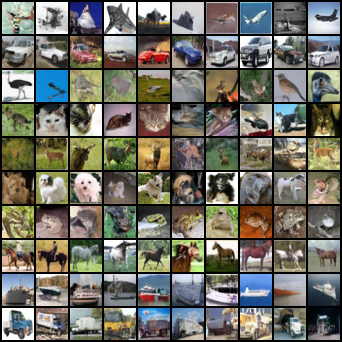

# Conditional Models

Let's now train some conditional models.

Instead of our model just taking $x_t$ and $t$ as input, we'll also pass the class index $c$ as input. This will allow us to generate samples from a specific class.

We'll use an additional embedding layer to encode the class index $c$.

```python
self.class_emb = torch.nn.Embedding(num_classes, embed_dim)
```

In our forward pass, we'll add the class embedding to the time embedding:

```python
emb = self.embed(t)  # time embedding
emb_class = self.class_emb(class_idx)  # class embedding
emb = emb + emb_class
```

## Training configs

In order to simplify the training options, we'll create some default configurations for our datasets and models. 
These will act as defaults for our CLI args.

For example, this is our CIFAR10 conditional model configuration:
```python
    "cifar10-cond": [
        'train',
        '--dataset', 'cifar10',
        '--conditional',
        '--batch-size', '128',
        '--grad-clip', '1',
        '--lr', '2e-4',
        '--warmup', '5000',
        '--steps', '800_000',
        '--val-interval', '2000',
        '--model-channels', '128',
        '--channel-mult', '1', '2', '2', '2',
        '--num-res-blocks', '2',
        '--attention-resolutions', '2',
        '--dropout', '0.1',
        '--hflip',
        '--save-checkpoints',
        '--log-interval', '5',
        '--progress',
    ]
```

Now we can train a CIFAR10 conditional model with the following command:
```bash
python main.py train --config cifar10-cond --gpu 0 --output-dir results/cifar10-cond
```

Our model will periodically generate samples from each of the classes and save the grid of images.
Here are the samples from the fully trained CIFAR10 conditional model:



Each of the rows corresponds to a different class:
- airplane
- automobile
- bird
- cat
- deer
- dog
- frog
- horse
- ship
- truck

