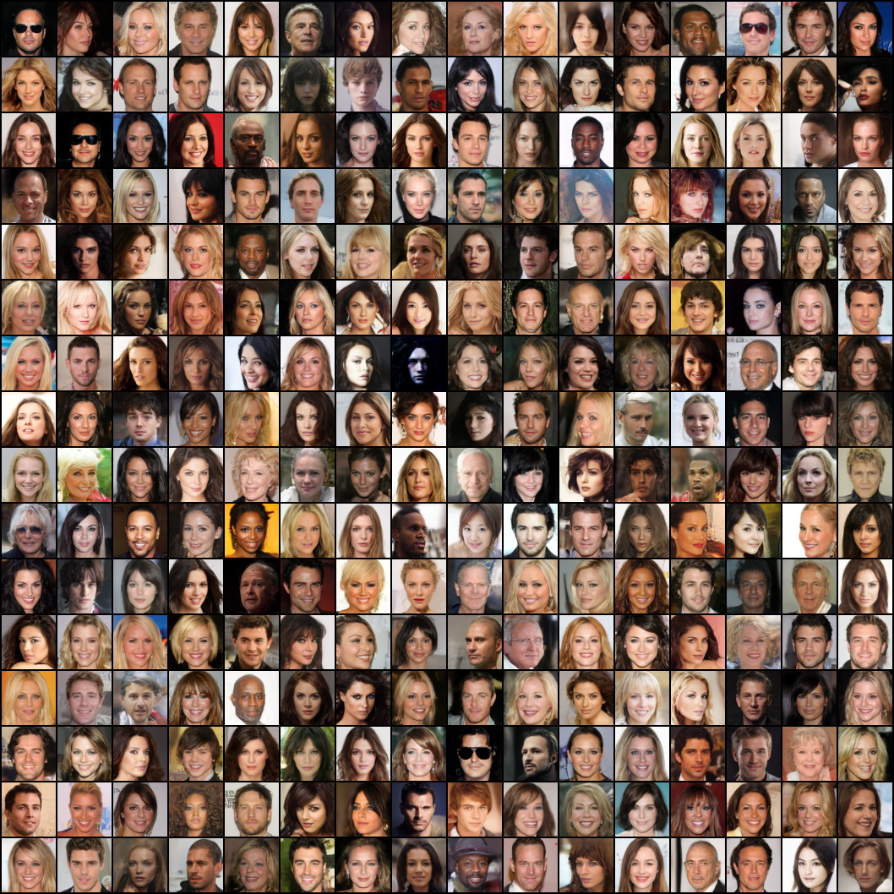

# CelebA

## Dataset

CelebA is a dataset of celebrity faces. We'll use the CelebA-HQ version, which contains 30K images which were cleaned, aligned, and upscaled to 1024x1024 resolution.

See the [Progressive Growing of GANS](https://github.com/tkarras/progressive_growing_of_gans) repo for more information of how to acquire the dataset.
The supplementary material from the paper explains in detail how they created the dataset.

We'll create a custom dataset class to load the images for our model.

```python
CSV = namedtuple("CSV", ["header", "index", "data"])

class CelebAHQ(torchvision.datasets.VisionDataset):
    def __init__(self, root,
                 target_type: Union[List[str], str] = "attr",
                 transform: Optional[Callable] = None,
                 target_transform: Optional[Callable] = None):
        super().__init__(root, transform=transform, target_transform=target_transform)
        if isinstance(target_type, list):
            self.target_type = target_type
        else:
            self.target_type = [target_type]

        if not self.target_type and self.target_transform is not None:
            raise RuntimeError("target_transform is specified but target_type is empty")

        attr = self._load_csv("CelebAMask-HQ-attribute-anno.txt", header=1)
        self.filename = attr.index
        self.attr = attr.data
        # map from {-1, 1} to {0, 1}
        self.attr = torch.div(self.attr + 1, 2, rounding_mode="floor")
        self.attr_names = attr.header

    def _load_csv(
            self,
            filename: str,
            header: Optional[int] = None,
    ) -> CSV:
        with open(os.path.join(self.root, filename)) as csv_file:
            data = list(csv.reader(csv_file, delimiter=" ", skipinitialspace=True))

        if header is not None:
            headers = data[header]
            data = data[header + 1:]
        else:
            headers = []

        indices = [row[0] for row in data]
        data = [row[1:] for row in data]
        data_int = [list(map(int, i)) for i in data]

        return CSV(headers, indices, torch.tensor(data_int))

    def __getitem__(self, index: int) -> Tuple[Any, Any]:
        X = Image.open(os.path.join(self.root, "CelebA-HQ-img-orig", self.filename[index]))

        target: Any = []
        for t in self.target_type:
            if t == "attr":
                target.append(self.attr[index, :])
            # elif t == "identity":
            #     target.append(self.identity[index, 0])
            # elif t == "bbox":
            #     target.append(self.bbox[index, :])
            # elif t == "landmarks":
            #     target.append(self.landmarks_align[index, :])
            else:
                # TODO: refactor with utils.verify_str_arg
                raise ValueError(f'Target type "{t}" is not recognized.')

        if self.transform is not None:
            X = self.transform(X)

        if target:
            target = tuple(target) if len(target) > 1 else target[0]

            if self.target_transform is not None:
                target = self.target_transform(target)
        else:
            target = None

        return X, target

    def __len__(self) -> int:
        return len(self.attr)
```

## Training

We have configs for training models at three different resolutions (64x64, 128x128, 256x256). 

Here is the config for the 64x64 model:

```python
    'celeba-64': [
        'train',
        '--dataset', 'celeba',
        '--resolution', '64',
        '--batch-size', '64',
        '--grad-clip', '1',
        '--lr', '2e-5',
        '--warmup', '5000',
        '--steps', '500_000',
        '--val-interval', '1000',
        '--model-channels', '128',
        '--channel-mult', '1', '1', '2', '2', '4', '4',
        '--num-res-blocks', '2',
        '--attention-resolutions', '16',
        '--dropout', '0.0',
        '--hflip',
        # '--save-checkpoints',
        '--log-interval', '5',
        '--progress',
    ],
```

For training the 256x256 model, we add grad accumulation, due to the batch size being too large to fit on a single GPU:
    
```python
    'celeba-256': [
        'train',
        '--dataset', 'celeba',
        '--resolution', '256',
        '--batch-size', '16',
        '--grad-clip', '1',
        '--grad-accum', '4',
        '--lr', '2e-5',
        '--warmup', '20_000',
        '--steps', '2_000_000',
        '--val-interval', '4000',
        '--model-channels', '128',
        '--channel-mult', '1', '1', '2', '2', '4', '4',
        '--num-res-blocks', '2',
        '--attention-resolutions', '16',
        '--dropout', '0.0',
        '--hflip',
        # '--save-checkpoints',
        '--log-interval', '5',
        '--progress',
    ],
```

Notice that we set the `--grad-accum` flag to 4. This means that we'll accumulate gradients over 4 batches before updating the model weights. 

We also modify the values of `--warmup`, `--steps`, and `--val-interval` by a factor of 4, as now our model will take 4 steps with grad accumulation to complete a single step had we not used it.

We add a few line to our training loop to implement gradient accumulation:

Instead of zeroing the optimizer at the end of each batch, we zero it every `grad_accum` batches:
```python
if batch_idx % grad_accum == 0:
    optimizer.zero_grad()
```

We divide the loss by the number of accumulated gradients before calling `loss.backward()`:
```python
loss = criterion(pred_noise, noise) / grad_accum
loss.backward()
```

And finally, we call `optimizer.step()` after `grad_accum` batches (or after the last batch in the dataloader)
```python
if (batch_idx + 1) % grad_accum == 0 or batch_idx == len(data_loader) - 1:
    if grad_clip is not None:
        torch.nn.utils.clip_grad_norm_(model.parameters(), grad_clip)
    optimizer.step()
```

## Commands

Here are CLI commands to train the CelebA models:

64x64 model:
```bash
python main.py train --config celeba-64 --gpu 0 --output-dir results/celeba-64
```

128x128 model:
```bash
python main.py train --config celeba-128 --gpu 0 --output-dir results/celeba-128
```

256x256 model:
```bash
python main.py train --config celeba-256 --gpu 0 --output-dir results/celeba-256
```

## Results

### 64x64 model:



### 128x128 model:


### 256x256 model:


