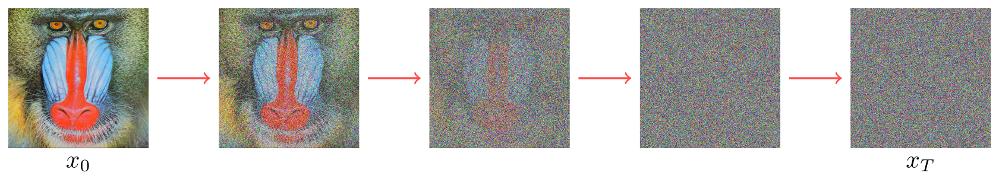
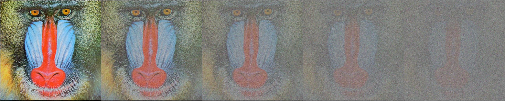
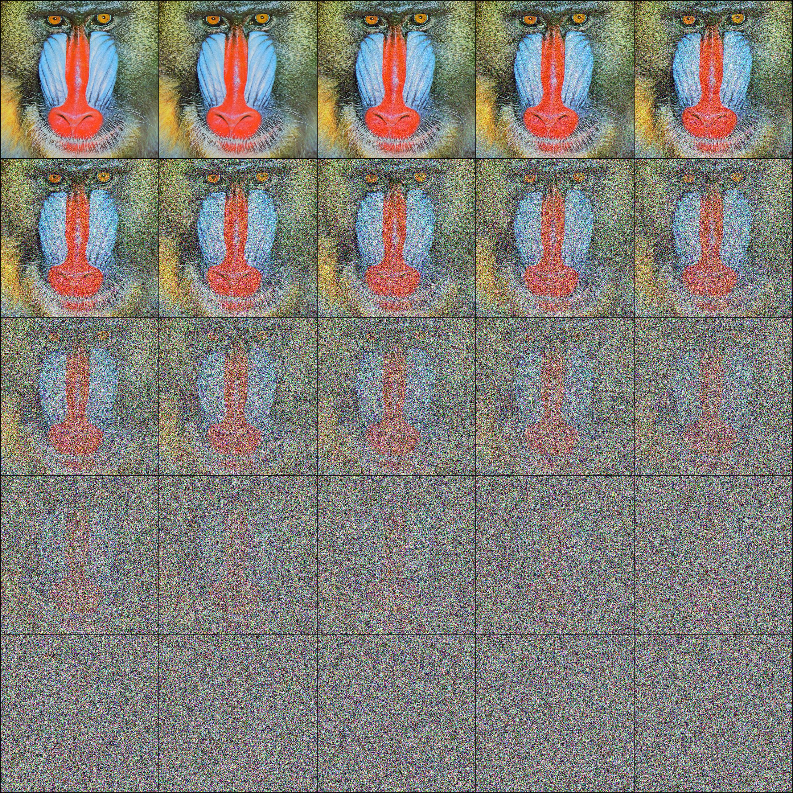

# Forward Process

## What is the forward process?

The basic idea of diffusion models is given some image, we want to progressively destroy the image over a series of timesteps. At each step, we add some Gaussian noise to the image. By the end of this sequence of steps, we are left with a completely random image, indistinguishable from Gaussian noise.



In the "Denoising Diffusion Probabilistic Models" paper by Ho et al. [[1]](#ho2020denoisingdiffusionprobabilisticmodels), the forward process is defined as:

$$
\Huge
q(x_t | x_{t-1}) := \mathcal{N}(x_{t}; \sqrt{1 - \beta_t} x_{t-1}, \beta_t \mathbf{I})
$$

If this seems complicated, don't worry! We'll build up to this definition step by step.

## (A) Building a very simple forward process

Ignoring the formal definition, let's try to write a simple function that takes an image and adds some Gaussian noise to it.

Let's simplify the definition of the forward process to:

$$
\Huge
\mathrm{new\ image} = \mathrm{Normal\ Distribution}(a * \mathrm{old\ image}, b)
$$

Where we sample from a normal distribution with mean $a * \text{old image}$ and standard deviation $b$.


If you're familiar with the "reparameterization trick" [[2]](#jayakody2023reparameterization), you might recognize that we can rewrite the above equation as:

$$
\Huge
\mathrm{new\ image} = a * \mathrm{old\ image} + b * \mathrm{Gaussian Noise}(0, 1)
$$

```python
def add_noise(x, a, b):
    noise = torch.randn_like(x)
    return (a * x) + (b * noise)
```

Try it out by running:
```bash
python part_a_very_simple_diffusion.py
```
You can also try changing the `image`, `a`, `b`, and `steps` arguments to see how that effects the output:
```bash
python part_a_very_simple_diffusion.py \
    --image data/mandrill.png \
    --a 0.5 \
    --b 0.1 \
    --steps 4
```

Using the defaults (`image=data/mandrill.png`, `a=0.5`, `b=0.1`, `steps=4`), our output looks like this:


Notice we also wrote two functions to normalize and denormalize the image. This is because we'd like our images to be scaled to $[-1, 1]$ before adding noise:
    
```python
def normalize(x):
    return 2 * x - 1

def denormalize(x):
    return (x + 1) / 2
```

## (B) Using fixed $\beta$ values

Let's modify our process to be more in line with the formal definition of the forward process:
1. Instead of separately defining $a$ and $b$, we'll use a single value, and define $a = 1 - b$. This way our output is more like a weighted sum of the old image and the noise. We'll rename these to $\alpha$ and $\beta$.
2. In the paper, $\beta$ refers to the variance, but we've been using the standard deviation. The formula for variance is $\text{var} = \text{std}^2$, so our standard deviation is $\sqrt{\beta}$.

Now our function looks like this:
$$
\Huge
\mathrm{new\ image} = \sqrt{1 - \beta} * \mathrm{old\ image} + \sqrt{\beta} * \mathrm{Gaussian Noise}(0, 1)
$$

```python
def add_noise(x, beta):
    noise = torch.randn_like(x)
    return math.sqrt(1 - beta) * x + math.sqrt(beta) * noise
```

Try it out by running:
```bash
python part_b_fixed_beta_values.py
```
You can also try changing the `image`, `beta`, and `steps` arguments to see how that effects the output:
```bash
python part_b_fixed_beta_values.py \
    --image data/mandrill.png \
    --beta 0.3 \
    --steps 24
```

Using the defaults (`image=data/mandrill.png`, `beta=0.3`, `steps=24`), our output looks like this:


One thing we quickly notice is that using a fixed $\beta$ value has a serious drawback:
* If $\beta$ is too small, the original image will still be slightly visible even after many steps.
* But if we raise $\beta$ to compensate, many of the intermediate steps will be too noisy.

## (C) Using a schedule for $\beta$

To address the issue of using a fixed $\beta$ value, we can use a schedule for $\beta$. This means we'll use different $\beta$ values at different steps. In the DDPM paper [[1]](#ho2020denoisingdiffusionprobabilisticmodels), they use a simple linear schedule for $\beta_t$, where $t$ is the current step and $T$ is the total number of steps.

Let's implement this schedule in our code. We'll use a class, and initialize the schedule values in our constructor:

```python
class NoiseScheduler:
    def __init__(self, steps=24, beta_start=1e-4, beta_end=0.6):
        super(NoiseScheduler, self).__init__()
        self.steps = steps
        self.beta_start = beta_start
        self.beta_end = beta_end
        self.beta = torch.linspace(beta_start, beta_end, steps)

    def add_noise(self, x, t):
        """
        Adds a single step of noise
        :param x: image we are adding noise to
        :param t: step number, 0 indexed (0 <= t < steps)
        :return: image with noise added
        """
        beta = self.beta[t]
        noise = torch.randn_like(x)
        return math.sqrt(1 - beta) * x + math.sqrt(beta) * noise
```

Try it out by running:
```bash
python part_c_schedule_for_beta.py
```

You can also try changing the `image`, `steps`, `beta_start` `beta_end` arguments to see how that effects the output:
```bash
python part_c_schedule_for_beta.py \
    --image data/mandrill.png \
    --beta-start 1e-4 \
    --beta-end 0.6 \
    --steps 24
```

Using the defaults (`image=data/mandrill.png`, `beta_start=1e-4`, `beta_end=0.6`, `steps=24`), our output looks like this:


We can already see that even with the same number of steps, using a schedule for $\beta$ gives us a much smoother transition from the original image to noise.

## (D) Sampling arbitrary timesteps

So far, we've only shown how to progress through the forward process one step at a time. But what if we want to get an image with noise at a specific timestep? If we have to go through all the intermediate steps, it would be very inefficient. When we begin training, we'll need to generate many samples at arbitrary timesteps for our training data.

In the paper, they use the following trick:

$$
\Huge
\alpha_t := 1 - \beta_t
$$

$$
\Huge
\bar{\alpha}_t := \prod_{s=1}^{t} \alpha_s
$$

And then the new formula for the forward process becomes:

$$
\Huge
\mathrm{new\ image} = \sqrt{\bar{\alpha}_t} * \text{old\ image} + \sqrt{1 - \bar{\alpha}_t} * \mathrm{Gaussian Noise}(0, 1)
$$

Let's implement this in our code:

```python
```


## References

1. <a id="ho2020denoisingdiffusionprobabilisticmodels"></a> Ho, J., Jain, A., & Abbeel, P. (2020). *Denoising Diffusion Probabilistic Models*. arXiv preprint [arXiv:2006.11239](https://arxiv.org/abs/2006.11239).
2. <a id="jayakody2023reparameterization"></a>Jayakody, D. (2023). *The Reparameterization Trick - Clearly Explained*. Retrieved from [https://dilithjay.com/blog/the-reparameterization-trick-clearly-explained](https://dilithjay.com/blog/the-reparameterization-trick-clearly-explained)