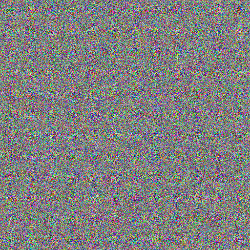

# Sampling / Inference

## How do we sample from a diffusion model?

#### Here is the basic procedure for sampling:

1. Sample $x_T$ from the normal distribution $\mathcal{N}(0, 1)$
2. For $t = T, \cdots, 1$:
   1. Sample $z$ from the normal distribution $\mathcal{N}(0, 1)$ if $t > 1$, else $z = 0$
   2. Compute the mean $\mu_t$ and variance $\sigma^2_t$, using $x_t$ and our schedule vars ($\bar{\alpha}_t$, $\beta_t$, etc.)
   3. Compute the previous stepL $x_{t-1} = \mu_t + \sigma_t * z$
4. Return $x_0$

---

#### The formulas for $\mu_t$ and $\sigma^2_t$ are:

$$
\Huge
\mu_{\theta}(x_t, t) = \frac{1}{\sqrt{\alpha_t}} \left( x_t - \frac{\beta_t}{\sqrt{1 - \bar{\alpha}_t}} \epsilon_{\theta}(x_t, t) \right)
$$

$$
\Huge
\sigma^2_{\theta}(x_t, t) = \frac{1 - \bar{\alpha}_t}{\sqrt{1 - \bar{\alpha}_t}} \beta_t
$$

---

## (A) Implementing the sampling process

Let's add a `sample_prev_step` function to our sampler module:

```python
 def sample_prev_step(self, xt, t, pred_noise):
   z = torch.randn_like(xt)
   z[t.expand_as(z) == 0] = 0

   mean = (1 / torch.sqrt(self.alpha[t])) * (xt - (self.beta[t] / torch.sqrt(1 - self.alpha_bar[t])) * pred_noise)
   var = ((1 - self.alpha_bar[t - 1])  / (1 - self.alpha_bar[t])) * self.beta[t]
   sigma = torch.sqrt(var)

   x = mean + sigma * z
   return x
```

Our sampling loop is relatively simple:

```python
 x = torch.randn(1, 3, 512, 512).to(device)
 for step in range(num_steps-1, -1, -1):
     t = torch.tensor(step, device=device).view(1,)
     pred_noise = model(x, t)
     x = noise_scheduler.sample_prev_step(x, t, pred_noise)
```

Of course, without a trained model, the output is pretty much noise:



## (B) Overfitting a single image

Let's combine this with our training code and see if we can overfit a single image
