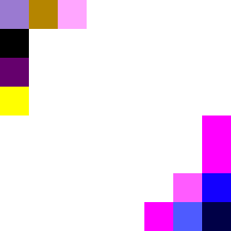

# Sampling / Inference

## How do we sample from a diffusion model?

#### Here is the basic procedure for sampling:

1. Sample $x_T$ from the normal distribution $\mathcal{N}(0, 1)$
2. For $t = T, \cdots, 1$:
   1. Sample $z$ from the normal distribution $\mathcal{N}(0, 1)$ if $t > 1$, else $z = 0$
   2. Compute the mean $\mu_t$ and variance $\sigma^2_t$, using $x_t$ and our schedule vars ($\bar{\alpha}_t$, $\beta_t$, etc.)
   3. Compute the previous stepL $x_{t-1} = \mu_t + \sigma_t * z$
4. Return $x_0$

---

#### The formulas for $\mu_t$ and $\sigma^2_t$ are:

$$
\Huge
\mu_{\theta}(x_t, t) = \frac{1}{\sqrt{\alpha_t}} \left( x_t - \frac{\beta_t}{\sqrt{1 - \bar{\alpha}_t}} \epsilon_{\theta}(x_t, t) \right)
$$

$$
\Huge
\sigma^2_{\theta}(x_t, t) = \frac{1 - \bar{\alpha}_t}{\sqrt{1 - \bar{\alpha}_t}} \beta_t
$$

---

## (A) Implementing the sampling process

Let's add a `sample_prev_step` function to our sampler module:

```python
 def sample_prev_step(self, xt, t, pred_noise):
   z = torch.randn_like(xt)
   z[t.expand_as(z) == 0] = 0

   mean = (1 / torch.sqrt(self.alpha[t])) * (xt - (self.beta[t] / torch.sqrt(1 - self.alpha_bar[t])) * pred_noise)
   var = ((1 - self.alpha_bar[t - 1])  / (1 - self.alpha_bar[t])) * self.beta[t]
   sigma = torch.sqrt(var)

   x = mean + sigma * z
   return x
```

Our sampling loop is relatively simple:

```python
 x = torch.randn(1, 3, 512, 512).to(device)
 for step in range(num_steps-1, -1, -1):
     t = torch.tensor(step, device=device).view(1,)
     pred_noise = model(x, t)
     x = noise_scheduler.sample_prev_step(x, t, pred_noise)
```

You can run this with:

```bash
python part_a_sampling.py
```

Of course, without a trained model, the output is not very good:


## (B) Overfitting a single image

Let's combine this with our training code and see if we can overfit a single image

We'll use a really small target image:

```python
 x0 = torch.zeros(1, 3, 8, 8).to(device)
 x0[:, :, 2:6, 2:6] = 1
```


*Note: (8x8), resized for display*

We train for 10,000 iterations, and sample at the end:

```bash
python part_b_overfitting.py
```

Unfortunately, the output is still pretty noisy:



## (C) Overfitting part 2.

Let's try to improve this:
* Our schedule is only 24 steps long. Let's increase it to 1000, and adjust our beta end to 0.02, to match the paper.
* We currently use a batch size of 1. Let's increase this to 128.
* Let's reduce our learning rate to `1e-4`
* Let's increase our iterations to 50k
* We're currently training in color, let's switch to grayscale.
* Finally, let's increase our model complexity.

Our new model uses more convolutional layers, larger filters, an embedding layer, and a linear projections for adding the embeddings to the intermediate steps:

```python
class Model(torch.nn.Module):
   def __init__(self, num_steps=1000):
      super(Model, self).__init__()

      self.conv1 = torch.nn.Conv2d(1, 64, 5, padding=2)
      self.conv2 = torch.nn.Conv2d(64, 64, 5, padding=2)
      self.conv3 = torch.nn.Conv2d(64, 64, 5, padding=2)
      self.conv4 = torch.nn.Conv2d(64, 64, 5, padding=2)
      self.conv5 = torch.nn.Conv2d(64, 64, 5, padding=2)
      self.conv6 = torch.nn.Conv2d(64, 1, 5, padding=2)


      self.embed = torch.nn.Sequential(
         torch.nn.Embedding(num_steps, 64),
         torch.nn.Linear(64, 64),
         torch.nn.ReLU(),
      )

      self.proj1 = torch.nn.Sequential(
         torch.nn.Linear(64, 64),
         torch.nn.ReLU(),
         torch.nn.Linear(64, 64),
      )
      self.proj2 = torch.nn.Sequential(
         torch.nn.Linear(64, 64),
         torch.nn.ReLU(),
         torch.nn.Linear(64, 64),
      )
      self.proj3 = torch.nn.Sequential(
         torch.nn.Linear(64, 64),
         torch.nn.ReLU(),
         torch.nn.Linear(64, 64),
      )
      self.proj4 = torch.nn.Sequential(
         torch.nn.Linear(64, 64),
         torch.nn.ReLU(),
         torch.nn.Linear(64, 64),
      )
      self.proj5 = torch.nn.Sequential(
         torch.nn.Linear(64, 64),
         torch.nn.ReLU(),
         torch.nn.Linear(64, 64),
      )

   def forward(self, x, t):
      emb = self.embed(t)

      conv1 = self.conv1(x)
      x = torch.nn.functional.relu(conv1)
      x = x + self.proj1(emb).view(-1, 64, 1, 1)

      x = self.conv2(x)
      x = torch.nn.functional.relu(x)
      x = x + self.proj2(emb).view(-1, 64, 1, 1)

      x = self.conv3(x)
      x = torch.nn.functional.relu(x)
      x = x + self.proj3(emb).view(-1, 64, 1, 1)

      x = self.conv4(x)
      x = torch.nn.functional.relu(x)
      x = x + self.proj4(emb).view(-1, 64, 1, 1)

      x = self.conv5(x)
      x = torch.nn.functional.relu(x)
      x = x + self.proj5(emb).view(-1, 64, 1, 1)

      x = self.conv6(x)
      return x
```

You can run this with:

```bash
python part_c_overfitting_2.py
```


This looks better. In the next chapter, let's explore some more serious model architectures, and see if we can get even better results.

